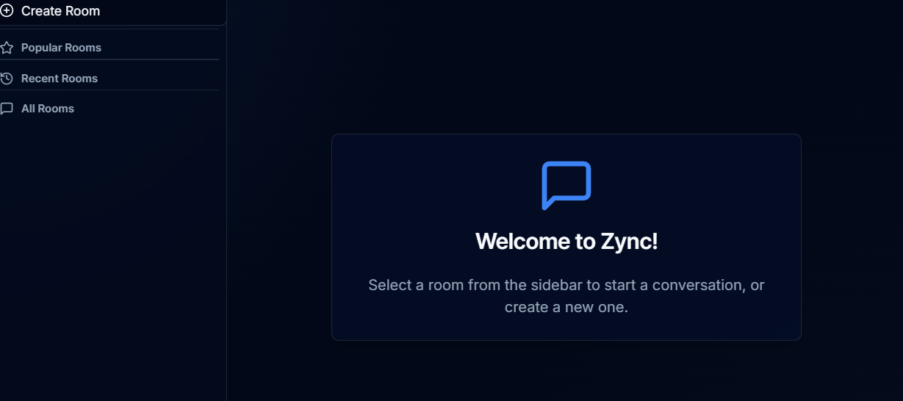

# Zync ⚡

A modern, real-time chat application built with Next.js and Firebase, featuring a sleek, glassmorphism-inspired dark theme.



## ✨ Features

- **Real-Time Messaging:** Instantly send and receive messages in public chat rooms powered by Firebase Firestore.
- **Create Rooms:** Users can create new chat rooms on the fly.
- **Server-Side Rate Limiting:** Room creation is globally rate-limited to 10 rooms per hour to prevent spam.
- **Responsive Design:** A sleek, modern UI that works beautifully on desktops, tablets, and mobile devices.
- **Dark Theme & Glassmorphism:** A beautiful dark theme with translucent, "glassy" UI elements for a modern feel.
- **User Authentication:** Simple username-based login with session persistence using browser storage.
- **Optimistic UI Updates:** The interface feels fast and responsive when creating rooms and sending messages.

## 🛠️ Tech Stack

- **Framework:** [Next.js](https://nextjs.org/) (with App Router)
- **Language:** [TypeScript](https://www.typescriptlang.org/)
- **UI:** [React](https://reactjs.org/)
- **Styling:** [Tailwind CSS](https://tailwindcss.com/)
- **Component Library:** [ShadCN UI](https://ui.shadcn.com/)
- **Backend & Database:** [Firebase](https://firebase.google.com/) (Firestore for real-time data & configuration)

## 🚀 Getting Started

### Prerequisites

- [Node.js](https://nodejs.org/en/) (v18 or later recommended)
- A [Firebase](https://console.firebase.google.com/) project

### Installation & Setup

1.  **Clone the repository:**
    ```bash
    git clone https://github.com/your-username/zync.git
    cd zync
    ```

2.  **Install dependencies:**
    ```bash
    npm install
    ```

3.  **Configure Firebase:**
    This is the most important step! The app will not work without it.
    - Create a Firebase project in the [Firebase Console](https://console.firebase.google.com/).
    - In your project, go to **Project settings** > **General**.
    - In the "Your apps" section, add a new Web App (</>).
    - After creating the app, you'll be given a `firebaseConfig` object. Copy it.
    - Paste this object into the `src/lib/firebase.ts` file, replacing the placeholder values.

    **File to edit: `src/lib/firebase.ts`**
    ```typescript
    const firebaseConfig = {
      apiKey: "YOUR_API_KEY",
      authDomain: "YOUR_AUTH_DOMAIN",
      projectId: "YOUR_PROJECT_ID",
      storageBucket: "YOUR_STORAGE_BUCKET",
      messagingSenderId: "YOUR_MESSAGING_SENDER_ID",
      appId: "YOUR_APP_ID"
    };
    ```

4.  **Run the development server:**
    ```bash
    npm run dev
    ```

    Open [http://localhost:9002](http://localhost:9002) in your browser to see the result. You can now log in, create rooms, and start chatting!
